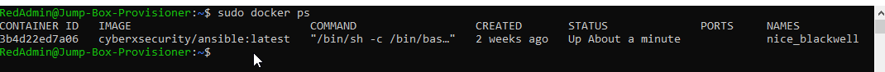

## Automated ELK Stack Deployment

The files in this repository were used to configure the network depicted below.

https://github.com/Linconjoe/Lincoln-Project-Cyber/blob/main/Diagrams/Home%20work%20week%2012.drawio.pdf

These files have been tested and used to generate a live ELK deployment on Azure. They can be used to either recreate the entire deployment pictured above. 
Alternatively, select portions of the filebeat-playbook.yml file may be used to install only certain pieces of it, such as Filebeat.

  - _TODO: Enter the playbook file._

# # Use command module
# # - name: Install filebeat .deb
# #    command: dpkg -i filebeat-7.4.0-amd64.deb

# # Use copy module
# # - name: Drop in filebeat.yml
#  #  copy:
#  #    src: /etc/ansible/files/filebeat-config.yml
#  #    dest: /etc/filebeat/filebeat.yml

This document contains the following details:
- Description of the Topologu
- Access Policies
- ELK Configuration
  - Beats in Use
  - Machines Being Monitored
- How to Use the Ansible Build

### Description of the Topology

The main purpose of this network is to expose a load-balanced and monitored instance of DVWA, the Damn Vulnerable Web Application.

Load balancing ensures that the application will be highly available, in addition to restricting authorized access to the network.
- _TODO: What aspect of security do load balancers protect? may stop denial of Service. 
What is the advantage of a jump box? You limit access to your network espically for users that need privalaged asscess controlled isolated access.

Integrating an ELK server allows users to easily monitor the vulnerable VMs for changes to the data and system logs.
- _TODO: What does Filebeat watch for? Collects Raw log files parse and visualize the logs. 
- _TODO: What does Metricbeat record? metrics and statistics, collects and ships the output to where you specify.

The configuration details of each machine may be found below.
_Note: Use the [Markdown Table Generator](http://www.tablesgenerator.com/markdown_tables) to add/remove values from the table_.

| Name     | Function | IP Address  | Operating System |
|----------|----------|-------------|------------------|
| Jump Box | Gateway  | 40.87.14.122| Linux            |
| Loadbal  | Server   | 40.71.5.148 | Linux            |
| web-1    | Server   | 10.0.0.5    | Linux            |
| web-2    | Server   | 10.0.0.6    | Linux            |

### Access Policies

The machines on the internal network are not exposed to the public Internet. 

Only the Loadbalancer machine can accept connections from the Internet. Access to this machine is only allowed from the following IP addresses:
- _TODO: Add whitelisted IP addresse 71.62.134.105

Machines within the network can only be accessed by the Jumpbox.
- _TODO: Which machine did you allow to access your ELK VM? Jumbox. What was its IP address?40.87.14.122

A summary of the access policies in place can be found in the table below.

| Name     | Publicly Accessible | Allowed IP Addresses                       |
|----------|---------------------|--------------------------------------------|
| Jump Box | Yes                 | 71.62.134.105,10.0.0.5 & 10.0.0.6,10.1.0.4 |
| Loadbal  | Yes                 | 71.62.134.105,                             |
| ElkSRV   | Yes                 | 71.62.134.105,                             |

### Elk Configuration

Ansible was used to automate configuration of the ELK machine. No configuration was performed manually, which is advantageous because...
- _TODO: What is the main advantage of automating configuration with Ansible? saves time to deploy/redploy. The main advan

The playbook implements the following tasks:
- _TODO: In 3-5 bullets, explain the steps of the ELK installation play. E.g., install Docker; download image; etc._
- INstall docker.io
- INstall pip3
- Install Docker Python moudule
- Download and launch container

The following screenshot displays the result of running `docker ps` after successfully configuring the ELK instance.

https://github.com/Linconjoe/Lincoln-Project-Cyber/blob/main/Images/docker_ps_output.png

### Target Machines & Beats
This ELK server is configured to monitor the following machines:
- _TODO: List the IP addresses of the machines you are monitoring_
Web-1	10.0.0.5
Web-2	10.0.0.6
We have installed the following Beats on these machines:
- _TODO: Specify which Beats you successfully installed_
Microbeats

These Beats allow us to collect the following information from each machine:
- _TODO: In 1-2 sentences, explain what kind of data each beat collects, and provide 1 example of what you expect to see. E.g., `Winlogbeat` collects Windows logs, which we use to track user logon events, etc._

Filebeat - collects data about the file system
Metricbeat - collects machine metrics, such as uptime

### Using the Playbook
In order to use the playbook, you will need to have an Ansible control node already configured. Assuming you have such a control node provisioned: 

SSH into the control node and follow the steps below:
- Copy the _____ file to _____.
- Update the _____ file to include...
- Run the playbook, and navigate to ____ to check that the installation worked as expected.

_TODO: Answer the following questions to fill in the blanks:_
- _Which file is the playbook? Where do you copy it?_
- _Which file do you update to make Ansible run the playbook on a specific machine? How do I specify which machine to install the ELK server on versus which to install Filebeat on?_
- _Which URL do you navigate to in order to check that the ELK server is running?  http://publicip:5601/app/kibana

_As a **Bonus**, provide the specific commands the user will need to run to download the playbook, update the files, etc._
